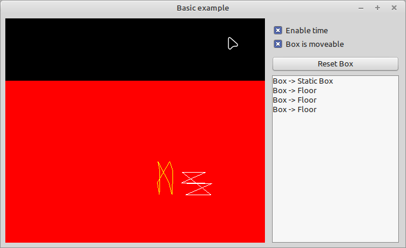

This is the most Basic Example that someone can think of.

## Content
- Initialize the Kraft Engine
- Create a floor plane
- Create some elements
- Simulate time and see results
- Change State of Object (solid / movable) and reset if needed
- Detect collisions
