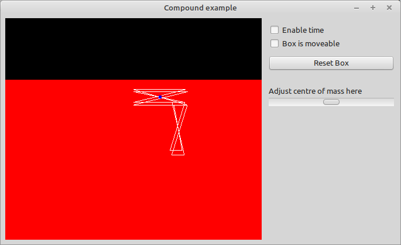

This Example shows how to setup a rigidbody that contains multiple shapes and how to manipulate its centre of mass.

## Content
- Initialize the Kraft Engine
- Create a floor plane
- Create Compound Elements
- Adjust Centre of mass of a compound object.

## Additional list of needed sources
- none

