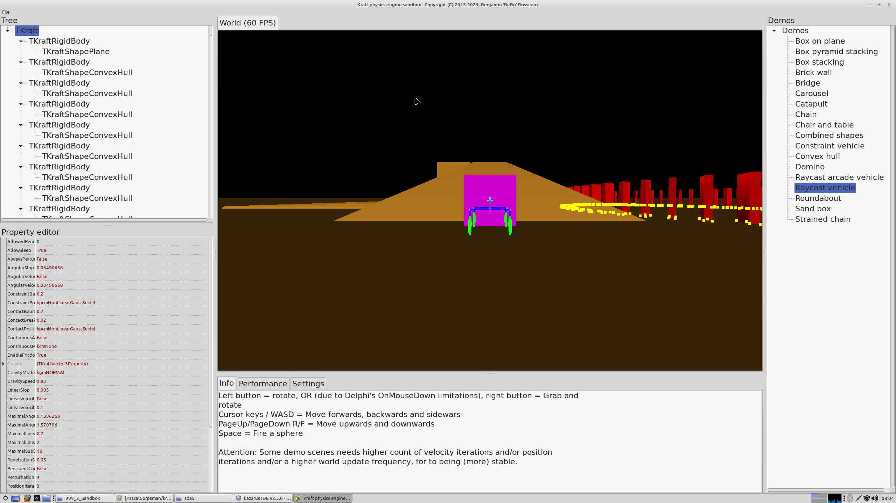

This is the "help" to get the Sandbox Example from the Kraft Repository compiled

## Content
??

## Additional list of needed sources
- Kraft multi processing library   https://github.com/BeRo1985/pasmp

- Kraft UTF8 support library   https://github.com/BeRo1985/pucu

- Kraft Double precission library   https://github.com/BeRo1985/pasdblstrutils

- Kraft JSON library   https://github.com/BeRo1985/pasjson
